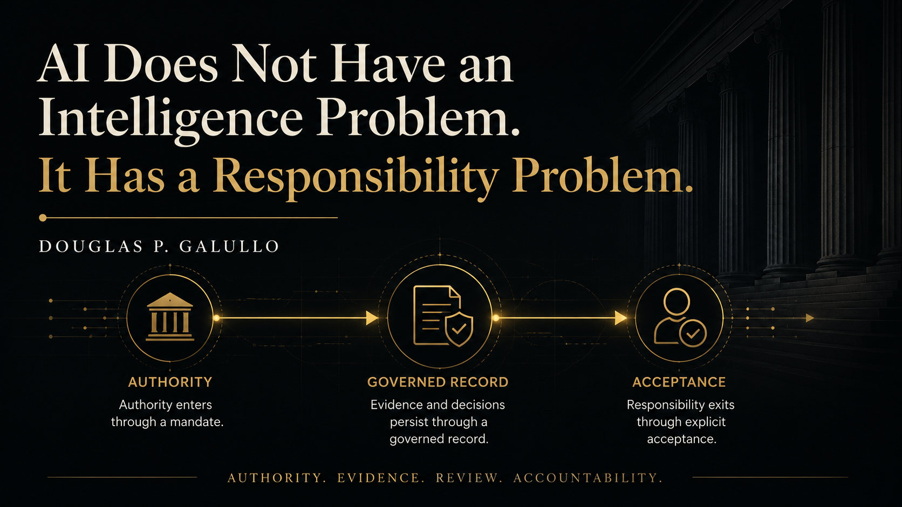

# Responsibility Infrastructure

This repository preserves the public record of an original thesis by **Douglas P. Galullo** on governance, authority, evidence, process, and human accountability in AI-assisted work.

## Article

[AI Does Not Have an Intelligence Problem. It Has a Responsibility Problem.](articles/ai-responsibility-problem.md)

*Notes from an ongoing experiment in governing AI-assisted work*

## Abstract

[Read the abstract](ABSTRACT.md)

## PDF Edition

[Download the publication PDF](pdf/galullo-ai-responsibility-problem.pdf)

## Core formulation

> Authority enters through a mandate. Evidence and decisions persist through a governed record. Responsibility exits through explicit acceptance.

## Status

- Version: 1.0
- Initial public record: July 18, 2026
- Author: Douglas P. Galullo
- Affiliation: Founder, Dog House Ventures LLC

## Copyright

Copyright © 2026 Douglas P. Galullo. All rights reserved.

This repository is a public record of the author's work. No license is granted for republication, modification, or commercial reuse without written permission.
